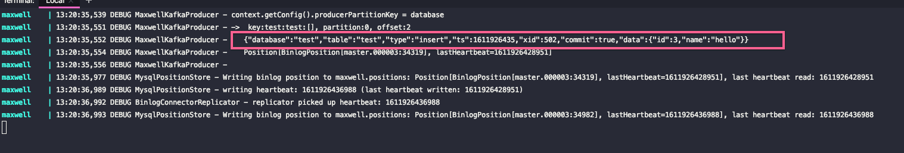

# Docker MySQL Kafka Maxwell

Docker compose setup to run MySQL Kafka and Maxwell (Change data capture)

This repo is based on [this github](https://github.com/githubcyc/docker-mysql-maxwell-kafka). 

It uses RabbitMQ
but it didn't work as expected and did not fulfill my objective, so I decided to create my own using Kafka

## Requirement 
Docker

## How to
1. Run docker compose (there is a bug with kafka that you need to use force-recreate, or it will produce an error)
```
docker-compose up --build --force-recreate
```
wait for all images downloaded and make sure containers ran OK

2. Connect to MySQL
```
host: localhost
user: root
pass: pass
db: test
port: 3306
```

Try to insert,update, delete data in "test" table. Maxwell will capture data changes and sent to Kafka (check from docker logs)

**Example Insert Data**


**Example Maxwell Log**



3. Check Kafka using kafdrop. Open kafdrop url on your browser
```
localhost:9000
```

You should see kafka topic "example-cdc-test".
Topic name is dynamic based on the source table you changed the data from
```
example-cdc-<table_name>
```
Browse into the topic then you can see your change data from "test" table queued there

Kafdrop Homepage, click "example-cdc-test"


Click View Messages link


Click View Messages button


Messages content "id : 3, name: hello"


4. If you have kafka consumer app, connect to kafka broker at **localhost:19092** and topic name = ""

Done. That's it CDC using MySQL, Kafka and Maxwell

Please message me if you have any issue and feel free to fork as well
